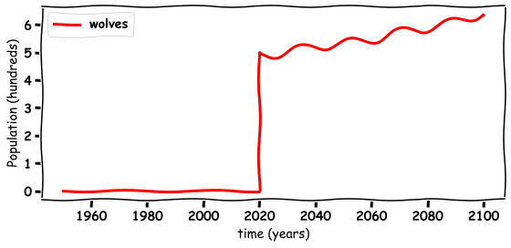
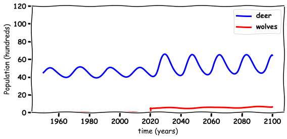

# Modelling the Re-introduction of Wolves

[John S Butler](johnsbutler.netlify.com)

School of Mathematical Sciences

TU Dublin

# Introduction
This webpage will describe a mathematical model that simulates impact of the introduction of wolves on deer and plants population using Python.


```python
import numpy as np
import math 

%matplotlib inline
import matplotlib.pyplot as plt # side-stepping mpl backend
import matplotlib.gridspec as gridspec # subplots
import warnings
font = {'family' : 'normal',
        'weight' : 'bold',
        'size'   : 14}

plt.rc('font', **font)
from IPython.display import HTML

HTML('''<script>
code_show=true; 
function code_toggle() {
 if (code_show){
 $('div.input').hide();
 } else {
 $('div.input').show();
 }
 code_show = !code_show
} 
$( document ).ready(code_toggle);
</script>
<form action="javascript:code_toggle()"><input type="submit" value="Click here to toggle on/off the raw code."></form>''')


```


<script>
code_show=true; 
function code_toggle() {
 if (code_show){
 $('div.input').hide();
 } else {
 $('div.input').show();
 }
 code_show = !code_show
} 
$( document ).ready(code_toggle);
</script>
<form action="javascript:code_toggle()"><input type="submit" value="Click here to toggle on/off the raw code."></form>


## What is mathematics used for?
* Neuroscience
* Engineering
* Physics
* Biology
* Football
* Computer Games
* Animation
* Nature


# Predator Prey 
## Predators and prey
The cyclical relationship of Predators and Prey in the wild  means that when there is an abundance of prey, the predators will eat more and the prey population will increase. On the other hand, if there is a shortage in the number of prey, the number of predators will decrease due to the scarcity of food sources [1-4]. 


```python
# INITIAL CONDITIONS
N=1000000
h=0.01
time = np.arange(1950, 2100, h )              # time
N=len(time)
plant=80*np.ones(N) # 60 billions small plant
deer=45*np.ones(N) # 30 billion deer
SMALLplant = np.array( [0.9,-0.02,0.03])
deer_constant= np.array([0.005,0.002,-0.001])
for i in range (1,N):
    plant[i]=plant[i-1]+h*plant[i-1]*(SMALLplant[0]+SMALLplant[1]*deer[i-1])
    deer[i]=deer[i-1]+h*deer[i-1]*(deer_constant[0]+deer_constant[1]*(plant[i-1]-40))
    
```

## Deers


The plot below shows the deer (blue) population as a function of time over 150 years.


```python
with plt.xkcd():
## PLOTTING
    fig = plt.figure(figsize=(8,4))
    plt.plot(time, deer, 'b-', label='deer',linewidth=3)
    plt.grid()
    plt.xlabel('time (years)')
    plt.ylabel('Population (hundreds)')
    plt.legend(loc='best')
    plt.tight_layout()
    plt.ylim([0,120])
  #  plt.savefig('deer_Hand.png', bbox_inches='tight',dpi=300)
    plt.show()
```


The deer population goes up and down on a year by year basis.

## What do deers eat?


Deers eat plants, and if the deer each too plants one year there are less the next.


```python
with plt.xkcd():
## PLOTTING
    fig = plt.figure(figsize=(8,4))
    plt.plot(time, plant, 'g-', label='plants',linewidth=3)
    plt.grid()
    plt.xlabel('time (years)')
    plt.ylabel('Population (hundreds)')
    plt.legend(loc='best')
    plt.tight_layout()
    plt.ylim([0,120])
#  plt.savefig('deer_.png', bbox_inches='tight',dpi=300)
    plt.show()
```


## The Maths model Deer and Plants
In a balanced eco system the relationship between plants (prey) and deer (predator) can be described mathematically using a Loketta-Volterra model [2-4]
\begin{equation}
\begin{array}{cl}
\frac{d P}{dt}=0.9P-0.02PD,\\
\frac{d D}{dt}=0.001D+0.001 (P-40)D,\\
\end{array}
\end{equation}
this set of equations models the interaction between plants (P) and deer (D). 

The equations can be written in words as:

| The rate of change of population | is equal to  | the current population with a control factor|
|-----------------------------------|--------------|------------------------------------------------------------------|
| The increase in plant population  $\frac{d P}{dt}$ | is equal to  | the current plant population $0.9P$ minus the amount of plants the deer eat $-0.02DP$ |
| The increase in deer population $\frac{d D}{dt}$ | is equal to | the current Deer population $0.005D$ plus the amount of fish salmon eat $+0.0001DP$|

Or they can be summed up as the deer are the predators who eat the plants to survive.


## Deer and Plants
### How does maths predict the future?
These differential equations can be re-written as __Adding and Subtraction__ using the Euler method [5-6]
\begin{equation}
\begin{array}{cl}
P_{Future}=P_{Current}+0.9P_{Current}-0.002P_{Current}\times D_{Current},\\
D_{Future}=D_{Current}+0.005D_{Current}+0.0001(P_{Current}-40) \times D_{Current}
\end{array}
\end{equation}
this set of equations models the interaction between plants (P) and deer (D). 


```python
with plt.xkcd():
    fig = plt.figure(figsize=(8,4))
    plt.plot(time, plant, 'g-', label='plants',linewidth=3)
    plt.plot(time, deer, 'b-', label='deer',linewidth=3)
    plt.grid()
    plt.xlabel('time (years)')
    plt.ylabel('Population (hundreds)')
    plt.legend(loc='best')
    plt.tight_layout()
    plt.ylim([0,120])
  #  plt.savefig('plant_deer.png', bbox_inches='tight',dpi=300)
    plt.show()
```


## What does a balanced ecosystem look like?

Below is a plot of balanced ecosystem, in the x-axis is the number of plants and the y is number of deer. The plot shows how the two interact and maintain an orbit around a equilibrium point (balance point).


```python
with plt.xkcd():
    fig = plt.figure(figsize=(6,6))
    plt.plot(plant, deer, 'k-', linewidth=3)
    plt.grid()
    plt.xlabel('plants')
    plt.ylabel('deer')
    plt.tight_layout()
    #plt.savefig('plant_vs_deer.png', bbox_inches='tight',dpi=300)
    plt.show()
```


# Wolves
Now the question is what would happen if we re-introduced wolves in for example 2020 [7]
https://www.irishtimes.com/news/politics/greens-call-for-wolves-to-be-reintroduced-to-ireland-1.4036692


Some of the concerns with this are:

1. Can the wolves maintain?

2. Will the wolves eat all the deer.

3. How will it impact other things in the eco system.

## Results
The plot below shows the population change of the wolves (red) which does maintain and grow after the re-introduction of 500 wolves.


```python
# INITIAL CONDITIONS
N=1000000
h=0.01
time = np.arange(1950, 2100, h )              # time
N=len(time)
plant=80*np.ones(N) # 60 billions small plant
deer=45*np.ones(N) # 30 billion deer
wolves=5*np.ones(N) # 30 billion deer
#wolves[time<2020]=0
SMALLplant = np.array( [0.9,-0.02,0.03])
deer_constant= np.array([0.005,0.002,-0.001])
wolves_constant= np.array([-0.05,0.001,0.0])

for i in range (1,N):
     if time[i-1]<2020:
        wolves[i-1]=0
     else:
         wolves[i]=wolves[i-1]+h*wolves[i-1]*(wolves_constant[0]+wolves_constant[1]*(deer[i-1]))
    
     plant[i]=plant[i-1]+h*plant[i-1]*(SMALLplant[0]+SMALLplant[1]*deer[i-1]+SMALLplant[2]*wolves[i-1])
     deer[i]=deer[i-1]+h*deer[i-1]*(deer_constant[0]+deer_constant[1]*(plant[i-1]-60)+deer_constant[2]*wolves[i-1])
```


```python
with plt.xkcd():
    fig = plt.figure(figsize=(8,4))
    plt.plot(time, wolves, 'r-', label='wolves',linewidth=3)
    plt.grid()
    plt.xlabel('time (years)')
    plt.ylabel('Population (hundreds)')
    plt.legend(loc='best')
    plt.tight_layout()
 #   plt.savefig('Wolves_Hand.png', bbox_inches='tight',dpi=300)
    plt.show()
```





## How does the introduction of Wolves impact Deer?

The plot below shows that surprisingly the introduction of wolves (red) results in an increase in population in deer (blue).


```python
with plt.xkcd():
    ## PLOTTING
    fig = plt.figure(figsize=(8,4))
    plt.plot(time, deer, 'b-', label='deer',linewidth=3)
    plt.plot(time, wolves, 'r-', label='wolves',linewidth=3)
    plt.grid()
    plt.xlabel('time (years)')
    plt.ylabel('Population (hundreds)')
    plt.legend(loc='best')
    plt.tight_layout()
    plt.ylim([0,120])
#    plt.savefig('Deer_Wolves_Hand.png', bbox_inches='tight',dpi=300)
    plt.show()
    
```





## Why do Wolves benefit?

It turns out that the re-introduction of wolves (red) results in an increase in plants (green) and hence an increase in deer (blue). 


```python
with plt.xkcd():
    fig = plt.figure(figsize=(8,4))
    plt.plot(time, plant, 'g-', label='plants',linewidth=3)
    plt.plot(time, deer, 'b-', label='deer',linewidth=3)
    plt.plot(time, wolves, 'r-', label='wolves',linewidth=3)
    plt.grid()
    plt.ylim([0,120])
    plt.xlabel('time (years)')
    plt.ylabel('Population (hundreds)')
    plt.legend(loc='best')
    plt.tight_layout()
  #  plt.savefig('Plants_Deer_Wolves_hand.png', bbox_inches='tight',dpi=300)

    plt.show()
```


## What does the new ecosystem look like?

## The Maths model Deer, Plants and Wolves
Here I add the volved to the model \begin{equation}
\begin{array}{cl}
\frac{d P}{dt}=0.9P-0.02PD+0.003PW,\\
\frac{d D}{dt}=0.001D+0.001 PD-0.001DW,\\
\frac{d W}{dt}=-0.05W+0.001 DW,\\
\end{array}
\end{equation}
this set of equations models the interaction between plants (P) and deer (D). 
### How does maths predict the future?
These differential equations can be re-written as __Adding and Subtraction__ 
\begin{equation}
\begin{array}{cl}
P_{Future}=P_{Current}+0.9P_{Current}-0.002P_{Current}\times D_{Current}+0.003P_{Current}W_{Current},\\
D_{Future}=D_{Current}+0.005D_{Current}+0.0001(P_{Current}-40) \times D_{Current}-0.001D_{Current}W_{Current}\\
W_{Future}=W_{Current}-0.05W_{Current}+0.0001P_{Current} \times W_{Current}
\end{array}
\end{equation}
this set of equations models the interaction between plants (P), deer (D) and wolves. 


## How does it impact the eco system
The introduction of wolves resulted in a new balanced ecosystem with more plants and wolves.


```python
with plt.xkcd():
    fig = plt.figure(figsize=(6,6))
    plt.plot(plant, deer, 'k-', linewidth=3)
    plt.grid()
    plt.xlabel('plants')
    plt.ylabel('deer')
    plt.tight_layout()
 #   plt.savefig('plant_vs_deer_and_Wolves.png', bbox_inches='tight',dpi=300)
    plt.show()
```


## Yellowstone Park

The models in this notebook are just toy problems maybe up to illustrate a point but they were inspired by the re-introduction of wolves into Yellowstone Park shown in the video below [8].


```python
from IPython.display import HTML

# Youtube
HTML('<iframe width="560" height="315" src="https://www.youtube.com/embed/ysa5OBhXz-Q" frameborder="0" allow="accelerometer; autoplay; encrypted-media; gyroscope; picture-in-picture" allowfullscreen></iframe>')

```

    /Users/johnbutler/anaconda3/lib/python3.7/site-packages/IPython/core/display.py:694: UserWarning: Consider using IPython.display.IFrame instead
      warnings.warn("Consider using IPython.display.IFrame instead")


<iframe width="560" height="315" src="https://www.youtube.com/embed/ysa5OBhXz-Q" frameborder="0" allow="accelerometer; autoplay; encrypted-media; gyroscope; picture-in-picture" allowfullscreen></iframe>


# Open Questions and Future Discussions

The model shows the benefit of wolves to a simple ecosystem model of plants and deer. Mathematical models of this type can be used to motivate the discussion.

The immediate questions that can arise from this simulation are:
1. How many wolves are beneficial?
2. Does Ireland have the same ecosystem as yellowstone?
3. What are hidden negatives?
4. What are hidden positives?

You can also look at the notebook on the negative impact of microplastics to our ecosystem [4].


# How does this describe our neck muscles
Similar models can be used to describe how muslces interact but instead of predators and prey the have contracting and expanding muscles.


```python
h=0.01
time = np.arange(0, 10, h )              # time
N=len(time)
Left=np.sin(time)
Right=np.cos(time)

with plt.xkcd():
    fig = plt.figure(figsize=(8,4))
    plt.plot(time, Left, 'g-', label='Left Side',linewidth=3)
    plt.plot(time, Right, 'b-', label='Right Side',linewidth=3)
    plt.grid()
    plt.xlabel('time (s)')
    plt.ylabel('Neck Muscle Activity')
    plt.yticks([-1,1],['expand','contract'])
    plt.legend(loc='best')
    plt.tight_layout()
    plt.show()
```


# References

[1]  Vito Volterra.  Fluctuations in the abundance of a species considered mathematically. Nature,118:558–560,1926.

[2] Wikipedia contributors. (2018, July 27). Lotka–Volterra equations. In Wikipedia, The Free Encyclopedia. Retrieved 09:33, September 7, 2018, from https://en.wikipedia.org/w/index.php?title=Lotka%E2%80%93Volterra_equations&oldid=852191432 

[3] Alfred J Lotka.   Analytical note on certain rhythmic  relations inorganic  systems.Proceedings of the National Academy of Sciences,6(7):410–415,1920.

[4] Aleksandra Samotyja, Gordon Chambers, John S Butler, Microplastic as Prey https://github.com/john-s-butler-dit/MicroPlastics

[5] Euler Method (2019, October 20) https://en.wikipedia.org/wiki/Euler_method

[6] John S Butler, Numerical Analysis for differential Equation, Chapter 1 Euler Method, (2019, October 20) https://github.com/john-s-butler-dit/Numerical-Analysis-Python/tree/master/Chapter%2001%20-%20Euler%20Methods

[7] Greens call for wolves to be reintroduced to Ireland (2019, October 20) https://www.irishtimes.com/news/politics/greens-call-for-wolves-to-be-reintroduced-to-ireland-1.4036692

[8] How Wolves Change a River (2019, October 20) https://www.youtube.com/embed/ysa5OBhXz-Q
