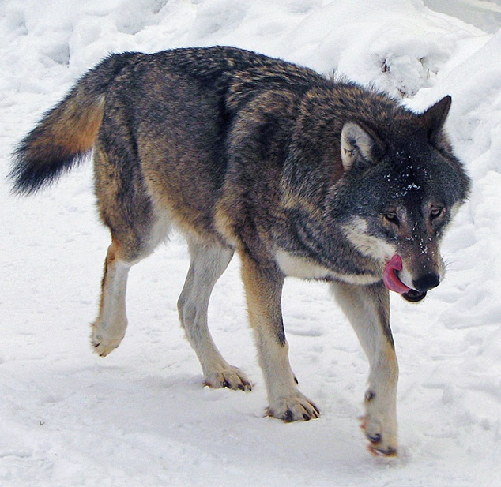

# The Introduction of Wolves

John S Butler

# Introduction
This webpage will describe a mathematical model that simulates impact of the introduction of wolves on deer and plants population using Python.


```python
import numpy as np
import math 

%matplotlib inline
import matplotlib.pyplot as plt # side-stepping mpl backend
import matplotlib.gridspec as gridspec # subplots
import warnings
font = {'family' : 'normal',
        'weight' : 'bold',
        'size'   : 14}

plt.rc('font', **font)
from IPython.display import HTML

HTML('''<script>
code_show=true; 
function code_toggle() {
 if (code_show){
 $('div.input').hide();
 } else {
 $('div.input').show();
 }
 code_show = !code_show
} 
$( document ).ready(code_toggle);
</script>
<form action="javascript:code_toggle()"><input type="submit" value="Click here to toggle on/off the raw code."></form>''')


```


<script>
code_show=true; 
function code_toggle() {
 if (code_show){
 $('div.input').hide();
 } else {
 $('div.input').show();
 }
 code_show = !code_show
} 
$( document ).ready(code_toggle);
</script>
<form action="javascript:code_toggle()"><input type="submit" value="Click here to toggle on/off the raw code."></form>


## What is mathematics used for?
* Neuroscience
* Engineering
* Physics
* Biology
* Football
* Computer Games
* Animation
* Nature


# Predator Prey 
## Predators and prey
The cyclical relationship of Predators and Prey in the wild  means that when there is an abundance of prey, the predators will eat more and the prey population will increase. On the other hand, if there is a shortage in the number of prey, the number of predators will decrease due to the scarcity of food sources. 
https://www.irishtimes.com/news/politics/greens-call-for-wolves-to-be-reintroduced-to-ireland-1.4036692


```python
# INITIAL CONDITIONS
N=1000000
h=0.01
time = np.arange(1950, 2100, h )              # time
N=len(time)
plant=80*np.ones(N) # 60 billions small plant
deer=45*np.ones(N) # 30 billion deer
SMALLplant = np.array( [0.9,-0.02,0.03])
deer_constant= np.array([0.005,0.002,-0.001])
for i in range (1,N):
    plant[i]=plant[i-1]+h*plant[i-1]*(SMALLplant[0]+SMALLplant[1]*deer[i-1])
    deer[i]=deer[i-1]+h*deer[i-1]*(deer_constant[0]+deer_constant[1]*(plant[i-1]-40))
```

## Deers


A plot of deers as a function of time.


```python
with plt.xkcd():
## PLOTTING
    fig = plt.figure(figsize=(8,4))
    plt.plot(time, deer, 'b-', label='deer',linewidth=3)
    plt.grid()
    plt.xlabel('time (years)')
    plt.ylabel('Population (hundreds)')
    plt.legend(loc='best')
    plt.tight_layout()
    plt.ylim([0,120])
    plt.savefig('deer_Hand.png', bbox_inches='tight',dpi=300)
    plt.show()
```


## What do deers eat?


```python
with plt.xkcd():
## PLOTTING
    fig = plt.figure(figsize=(8,4))
    plt.plot(time, plant, 'g-', label='plants',linewidth=3)
    plt.grid()
    plt.xlabel('time (years)')
    plt.ylabel('Population (hundreds)')
    plt.legend(loc='best')
    plt.tight_layout()
    plt.ylim([0,120])
    plt.savefig('deer_.png', bbox_inches='tight',dpi=300)
    plt.show()
```


## Deer and Plants
In a balanced eco system the relationship between plants (prey) and deer (predator) can be described mathematically using a Loketta-Volterra model [2-4]
\begin{equation}
\begin{array}{cl}
\frac{d P}{dt}=0.9P-0.02PD,\\
\frac{d D}{dt}=0.001D+0.001 PD,\\
\end{array}
\end{equation}
this set of equations models the interaction between plants (P) and deer (D). 

The equations can be written in words as:

| The rate of change of population | is equal to  | the current population with a control factor|
|-----------------------------------|--------------|------------------------------------------------------------------|
| The increase in plant population  $\frac{d P}{dt}$ | is equal to  | the current plant population $0.9P$ minus the amount of plants the deer eat $-0.02DP$ |
| The increase in deer population $\frac{d D}{dt}$ | is equal to | the current Deer population $0.005D$ plus the amount of fish salmon eat $+0.0001DP$|

Or they can be summed up as the salmon are the predators who eat the small fish to survive.


## Deer and Plants
### How does maths predict the future?
__Adding and Subtraction__ 
\begin{equation}
\begin{array}{cl}
P_{Future}=P_{Current}+0.9P_{Current}-0.002P_{Current}\times D_{Current},\\
D_{Future}=D_{Current}+0.005D_{Current}+0.0001P_{Current} \times D_{Current}
\end{array}
\end{equation}
this set of equations models the interaction between plants (P) and deer (D). 


```python
with plt.xkcd():
    fig = plt.figure(figsize=(8,4))
    plt.plot(time, plant, 'g-', label='plants',linewidth=3)
    plt.plot(time, deer, 'b-', label='deer',linewidth=3)
    plt.grid()
    plt.xlabel('time (years)')
    plt.ylabel('Population (hundreds)')
    plt.legend(loc='best')
    plt.tight_layout()
    plt.ylim([0,120])
    plt.savefig('plant_deer.png', bbox_inches='tight',dpi=300)
    plt.show()
```


## What does a balanced ecosystem look like?


```python
with plt.xkcd():
    fig = plt.figure(figsize=(6,6))
    plt.plot(plant, deer, 'k-', linewidth=3)
    plt.grid()
    plt.xlabel('plants')
    plt.ylabel('deer')
    plt.tight_layout()
    #plt.savefig('plant_vs_deer.png', bbox_inches='tight',dpi=300)
    plt.show()
```


This is a balanced ecosystem.

# Wolves



```python
# INITIAL CONDITIONS
N=1000000
h=0.01
time = np.arange(1950, 2100, h )              # time
N=len(time)
plant=80*np.ones(N) # 60 billions small plant
deer=45*np.ones(N) # 30 billion deer
wolves=5*np.ones(N) # 30 billion deer
#wolves[time<2020]=0
SMALLplant = np.array( [0.9,-0.02,0.03])
deer_constant= np.array([0.005,0.002,-0.001])
wolves_constant= np.array([-0.05,0.001,0.0])

for i in range (1,N):
     if time[i-1]<2020:
        wolves[i-1]=0
     else:
         wolves[i]=wolves[i-1]+h*wolves[i-1]*(wolves_constant[0]+wolves_constant[1]*(deer[i-1]))
    
     plant[i]=plant[i-1]+h*plant[i-1]*(SMALLplant[0]+SMALLplant[1]*deer[i-1]+SMALLplant[2]*wolves[i-1])
     deer[i]=deer[i-1]+h*deer[i-1]*(deer_constant[0]+deer_constant[1]*(plant[i-1]-60)+deer_constant[2]*wolves[i-1])
```


```python
with plt.xkcd():
    fig = plt.figure(figsize=(8,4))
    plt.plot(time, wolves, 'r-', label='wolves',linewidth=3)
    plt.grid()
    plt.xlabel('time (years)')
    plt.ylabel('Population (hundreds)')
    plt.legend(loc='best')
    plt.tight_layout()
    plt.savefig('Wolves_Hand.png', bbox_inches='tight',dpi=300)
    plt.show()
```


## How does the introduction of Wolves impact Deer?


```python
with plt.xkcd():
    ## PLOTTING
    fig = plt.figure(figsize=(8,4))
    plt.plot(time, deer, 'b-', label='deer',linewidth=3)
    plt.plot(time, wolves, 'r-', label='wolves',linewidth=3)
    plt.grid()
    plt.xlabel('time (years)')
    plt.ylabel('Population (hundreds)')
    plt.legend(loc='best')
    plt.tight_layout()
    plt.ylim([0,120])
    plt.savefig('Deer_Wolves_Hand.png', bbox_inches='tight',dpi=300)
    plt.show()
    
```


## Why do Wolves benefit?


```python
with plt.xkcd():
    fig = plt.figure(figsize=(8,4))
    plt.plot(time, plant, 'g-', label='plants',linewidth=3)
    plt.plot(time, deer, 'b-', label='deer',linewidth=3)
    plt.plot(time, wolves, 'r-', label='wolves',linewidth=3)
    plt.grid()
    plt.ylim([0,120])
    plt.xlabel('time (years)')
    plt.ylabel('Population (hundreds)')
    plt.legend(loc='best')
    plt.tight_layout()
    plt.savefig('Plants_Deer_Wolves_hand.png', bbox_inches='tight',dpi=300)

    plt.show()
```


## What does the new ecosystem look like?


```python
with plt.xkcd():
    fig = plt.figure(figsize=(6,6))
    plt.plot(plant, deer, 'k-', linewidth=3)
    plt.grid()
    plt.xlabel('plants')
    plt.ylabel('deer')
    plt.tight_layout()
    plt.savefig('plant_vs_deer_and_Wolves.png', bbox_inches='tight',dpi=300)
    plt.show()
```


## Yellowstone Park


```python
from IPython.display import HTML

# Youtube
HTML('<iframe width="560" height="315" src="https://www.youtube.com/embed/ysa5OBhXz-Q" frameborder="0" allow="accelerometer; autoplay; encrypted-media; gyroscope; picture-in-picture" allowfullscreen></iframe>')

```

    /Users/johnbutler/anaconda3/lib/python3.7/site-packages/IPython/core/display.py:694: UserWarning: Consider using IPython.display.IFrame instead
      warnings.warn("Consider using IPython.display.IFrame instead")


<iframe width="560" height="315" src="https://www.youtube.com/embed/ysa5OBhXz-Q" frameborder="0" allow="accelerometer; autoplay; encrypted-media; gyroscope; picture-in-picture" allowfullscreen></iframe>


# How does this describe our neck muscles


```python
h=0.01
time = np.arange(0, 10, h )              # time
N=len(time)
Left=np.sin(time)
Right=np.cos(time)

with plt.xkcd():
    fig = plt.figure(figsize=(8,4))
    plt.plot(time, Left, 'g-', label='Left Side',linewidth=3)
    plt.plot(time, Right, 'b-', label='Right Side',linewidth=3)
    plt.grid()
    plt.xlabel('time (s)')
    plt.ylabel('Neck Muscle Activity')
    plt.yticks([-1,1],['expand','contract'])
    plt.legend(loc='best')
    plt.tight_layout()
    plt.show()
```


